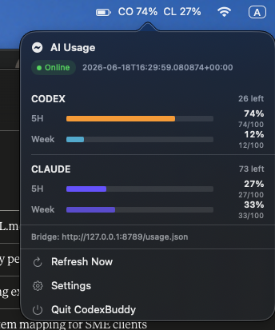

# CodexBuddyMac

CodexBuddyMac is a macOS menu bar app that displays Codex and Claude Code usage.
It runs a local Python bridge, polls the providers' usage endpoints, and keeps the
latest snapshot on the Mac.

<p align="center">
  
</p>

See both services at a glance without interrupting your workflow. The compact
menu shows current five-hour and weekly usage, remaining capacity, connection
status, and one-click refresh controls.

## Highlights

- Codex and Claude Code usage in one menu bar view
- Five-hour and weekly usage windows
- Local-only bridge bound to `127.0.0.1`
- Automatic refresh with offline fallback
- Optional launch at login

## Requirements

- macOS 26.5 or later
- Xcode 26.5 or later
- Python 3 from Xcode Command Line Tools
- Codex CLI signed in for Codex usage
- Claude Code signed in for Claude usage

## Download And Run

1. Download the repository ZIP from GitHub or clone the repository.
2. Open `CodexBuddyMac/CodexBuddyMac.xcodeproj` in Xcode.
3. Replace `com.example.CodexBuddyMac` with a bundle identifier registered to
   your Apple Developer account.
4. Replace `group.com.example.CodexBuddyMac` in the app, widget, entitlements,
   and `UsageStore.swift` files with your registered App Group.
5. Select your development team and run the `CodexBuddyMac` scheme.

Sign in to the command-line tools when required:

```bash
codex login
claude auth login
```

The app starts its bundled bridge at `http://127.0.0.1:8789/usage.json`.

## Privacy And Security

- Credentials are not stored in this repository or copied into the app bundle.
- Codex credentials are read locally from the Codex CLI authentication file.
- Claude credentials are read locally from Claude Code's macOS Keychain entry
  or credentials file.
- The bridge binds to `127.0.0.1` by default and is not exposed to the local
  network.
- Usage responses are cached locally and are not uploaded by CodexBuddyMac.
- Do not commit local logs, build products, user data, credentials, or signing
  profiles. The included `.gitignore` excludes these files.

The bridge calls provider usage endpoints using the user's existing CLI OAuth
session. These endpoints may change because they are controlled by their
respective providers.

## Troubleshooting

- If Claude remains at zero, run `claude auth status` and sign in if necessary.
- If the bridge is stale, quit the app, stop any process using port `8789`, and
  relaunch the app.
- App logs are stored under `~/Library/Application Support/CodexBuddy/Logs`.

## Repository Layout

- `CodexBuddyMac/CodexBuddyMac`: menu bar app and bundled bridge
- `CodexBuddyMac/CodexBuddyWidgetExtension`: widget source
- `CodexBuddyMac/CodexBuddyMac.xcodeproj`: Xcode project
